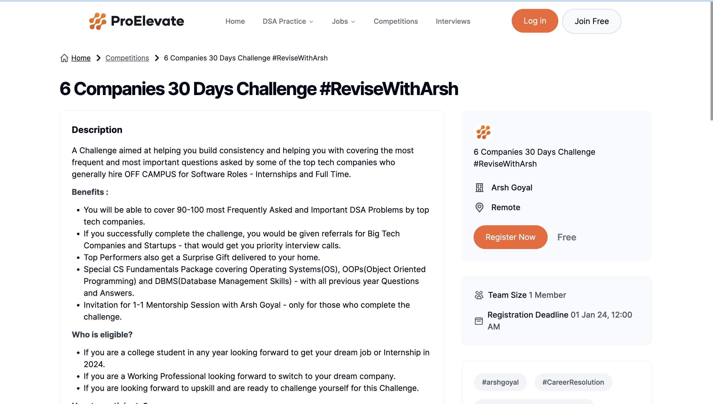

# 6Companies30Days
The #6Companies30Days Challenge, led by Arsh Goyal, is a month-long coding journey to solve 90 important coding questions, recently asked by a top tech company, helping to improve skills and prepare for interviews.

